# Kraken Leads — Test Task (AI Engineer, SEO & Affiliate, iGaming)

> Тестове завдання на позицію AI Engineer • Test task for the AI Engineer position
> Test task PDF: [`raw/kraken-leads-test-task.pdf`](raw/kraken-leads-test-task.pdf)

Дві задачі в одному репозиторії:

- **Task 1** — концепція повністю автоматизованої системи генерації SEO-сайтів (Google Sheets → SERP → AI content → Cloudflare Pages). Згідно PDF — лише **теоретична частина**.
- **Task 2** — концепція моніторингу брендованої видачі StarCasino (NL) з автоматичною класифікацією доменів на 3 категорії, **плюс робочий прототип** (вимога PDF, у плані: [`prototype/`](prototype/)).

---

## 🗺️ Архітектура

### Task 1 — SEO Automation System (theoretical)



### Task 2 — Branded SERP Monitor (StarCasino NL) — theoretical + prototype



### Documentation — Karpathy LLM-Wiki



Деталі та [[wikilinks]] на atomic-сторінки → [wiki/synthesis/architecture-overview.md](wiki/synthesis/architecture-overview.md) (UA) · [wiki-en/synthesis/architecture-overview.md](wiki-en/synthesis/architecture-overview.md) (EN).

---

## 📚 Як читати документацію

Документація організована за методом **[Karpathy LLM-Wiki](https://gist.github.com/karpathy/442a6bf555914893e9891c11519de94f)** — atomic markdown pages + cross-references + version-controlled schema.

### Швидкий шлях (Reviewer, 10 хв)

| Крок | Файл | Мета |
|---|---|---|
| 1 | [`README.md`](README.md) (цей файл) | Огляд + діаграми |
| 2 | [`CLAUDE.md`](CLAUDE.md) | Методологія, iron rules, skills matrix |
| 3 | [`wiki/synthesis/architecture-overview.md`](wiki/synthesis/architecture-overview.md) | Архітектура з посиланнями на atomic concepts |
| 4 | [`wiki/synthesis/task-2-answer.md`](wiki/synthesis/task-2-answer.md) | Sequential відповідь на 10 PDF-питань Task 2 |
| 5 | [`wiki/concepts/`](wiki/concepts/) | Atomic concept pages (по одній на під-питання PDF) |
| 6 | [`prototype/`](prototype/) | Робочий прототип Task 2 (у плані) |

### Структура репозиторію

```
kraken-test/
├── README.md                    ← ви тут
├── CLAUDE.md                    ← schema + project memory (Karpathy)
├── raw/                         ← immutable sources (PDF + external refs)
├── wiki/                        ← UA wiki (primary)
│   ├── index.md, log.md
│   ├── entities/  concepts/  sources/  comparisons/  synthesis/
│   └── assets/diagrams/         ← SVG/Mermaid sources
├── wiki-en/                     ← EN mirror
└── prototype/                   ← Робочий прототип Task 2 (StarCasino monitor, у плані)
```

---

## 🚀 Quick start — Task 2 prototype

```bash
# (Coming soon — у плані)
cd prototype
cp .env.example .env       # SERPAPI_KEY, OPENROUTER_API_KEY
npm install && npx playwright install chromium
npm run analyze            # один реальний run для top-10 NL "starcasino"
npm run dashboard          # http://localhost:3000
```

Без API-ключів буде доступний `npm run analyze:mock` на fixture-даних.

---

## 🛠️ Tools & Methodology

- **Документація:** [`llm-wiki@claude-code-skills`](https://github.com/anthropics/claude-code-skills) (Karpathy method) + paralleled UA/EN trees
- **Code quality:** [`karpathy-coder@claude-code-skills`](https://github.com/anthropics/claude-code-skills) (4 principles)
- **Діаграми:** Mermaid → SVG через [mermaid.ink](https://mermaid.ink/)
- **Task 2 prototype stack:** Node.js 20 + TypeScript 5 strict + Fastify + Playwright + SQLite + OpenRouter (LLM gateway) + SerpAPI

---

## 📦 Deliverables checklist

- [x] Karpathy LLM-Wiki vault (UA + EN mirror, schema, templates, index, log)
- [x] Source-summary [`wiki/sources/kraken-leads-test-task.md`](wiki/sources/kraken-leads-test-task.md)
- [x] Architecture overview з 3 SVG-діаграмами
- [x] Atomic concept pages (Task 1 intake): `google-sheets-intake`, `web-ui-intake`, `task-queue`
- [x] Atomic concept pages (Task 2): `domain-classification`, `affiliate-detection`, `competitor-thief-detection`, `classifier-scoring`, `scaling-bottlenecks`
- [x] Entity: [`starcasino-nl`](wiki/entities/starcasino-nl.md)
- [x] Synthesis: [`task-2-answer.md`](wiki/synthesis/task-2-answer.md) — primary deliverable view
- [ ] Synthesis: `task-1-answer.md` — sequential відповіді на Task 1 PDF (у плані)
- [ ] **Робочий прототип Task 2** (StarCasino monitor — у плані)
- [ ] Решта concepts/entities/ADRs Task 1 (forward refs у плані)

---

## 🇺🇸 English

Same repository, both languages. EN documentation mirrors the UA primary tree under `wiki-en/`. Read the architecture overview at [`wiki-en/synthesis/architecture-overview.md`](wiki-en/synthesis/architecture-overview.md). Per the PDF brief, Task 1 is purely theoretical; only Task 2 requires a working prototype.

---

*Час витрачено на цю частину: TBD у фінальному звіті.*
