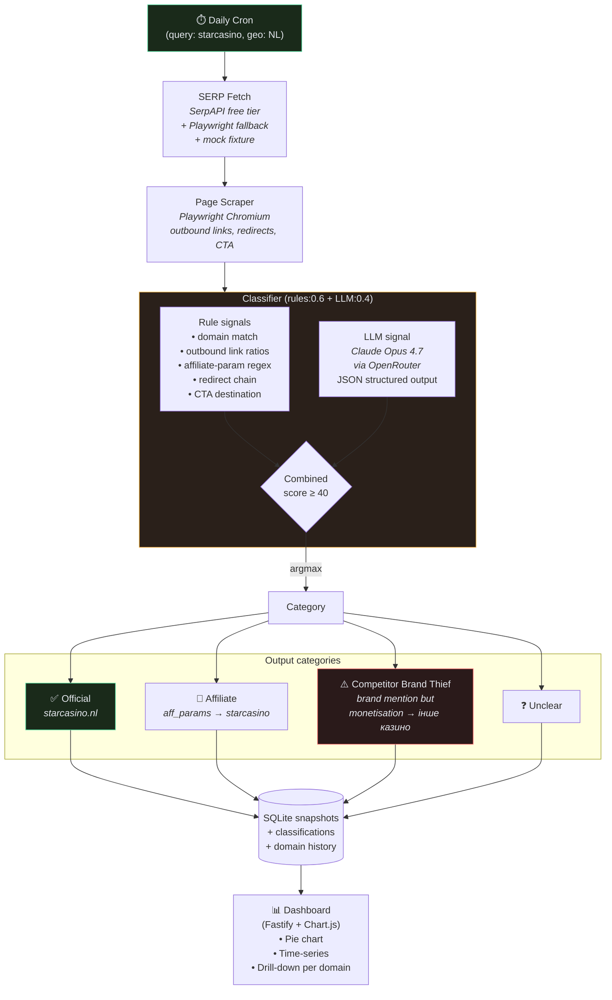
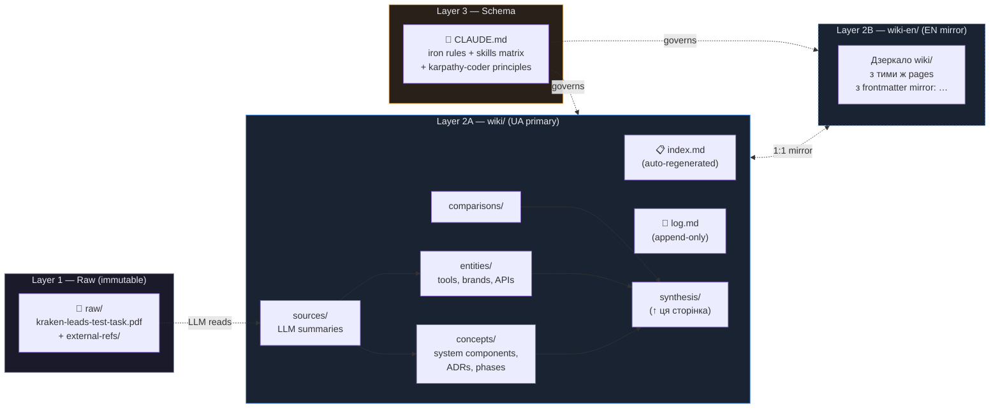

# Architecture overview

## TL;DR
Проект складається з трьох незалежних, але семантично пов'язаних шарів: (1) **Task 1** — концепція та частковий PoC системи генерації SEO-сайтів (intake → queue → pipeline → publish); (2) **Task 2** — повний прототип моніторингу брендованої видачі з класифікатором; (3) **документація** — Karpathy LLM-Wiki з atomic-pages в UA+EN. Реалізовано: intake-шар Task 1 + Task 2 prototype (в плані).

---

## Шар 1 — Task 1: SEO Automation System

> 📄 [Mermaid source](../assets/diagrams/task-1-architecture.mmd) (для редагування/regen)

```mermaid
flowchart LR
    subgraph SOURCES["Task intake (реалізовано в intake/)"]
      direction TB
      S1["📊 Google Sheets<br/><i>OAuth 2.0 + 60s polling</i>"]
      S2["📝 Web Form UI<br/><i>Fastify + Vanilla JS</i>"]
    end

    I["Intake Service<br/>(intake/src/sheets, web)"]
    Q[("Unified Task Queue<br/>SQLite + state machine")]
    SIM["Status Simulator<br/>(queued → … → published)"]

    subgraph PIPE["Pipeline (концепція, не реалізовано)"]
      direction LR
      P1["SERP Analysis<br/><i>SerpAPI / DataForSEO</i>"]
      P2["Competitor Scraping<br/><i>Playwright + Readability</i>"]
      P3["Topical Brief<br/><i>LLM clustering</i>"]
      P4["AI Content<br/><i>Claude Sonnet via OpenRouter</i>"]
      P5["HTML + SEO<br/><i>Astro + Schema.org</i>"]
      P6["Deploy<br/><i>Cloudflare Pages API</i>"]
      P1 --> P2 --> P3 --> P4 --> P5 --> P6
    end

    S1 -->|"polling"| I
    S2 -->|"POST /api/tasks"| I
    I --> Q
    Q --> SIM
    SIM -.->|"коли task source='sheet'"| S1
    SIM ---> PIPE
    PIPE -->|"output URL"| SIM

    style SOURCES fill:#1a2332,stroke:#4ea1ff,color:#e4e7ee
    style PIPE fill:#2a1a2a,stroke:#b06bff,color:#e4e7ee,stroke-dasharray: 5 5
```

Mermaid source (inline)

**Ключові концепти:** [[../concepts/google-sheets-intake]], [[../concepts/web-ui-intake]], [[../concepts/task-queue]] (реалізовано); [[../concepts/serp-collection]], [[../concepts/competitor-scraping]], [[../concepts/content-generation-pipeline]], [[../concepts/seo-quality-control]], [[../concepts/html-schema-markup]], [[../concepts/cloudflare-deployment]] (концепція).

---

## Шар 2 — Task 2: Branded SERP Monitor (StarCasino NL)

> 📄 [Mermaid source](../assets/diagrams/task-2-architecture.mmd) (для редагування/regen)

Mermaid source (inline)

**Ключове розрізнення affiliate vs competitor-thief:** дивись [[../comparisons/affiliate-vs-brand-thief-signals]]. Decisive signal — **final destination of monetised links after redirect resolution**, не brand mention.

---

## Шар 3 — Documentation (Karpathy LLM-Wiki)

> 📄 [Mermaid source](../assets/diagrams/docs-layer.mmd) (для редагування/regen)

Mermaid source (inline)

**Iron rules:** raw/ immutable, всі writes — у wiki/wiki-en/, кожна сторінка має frontmatter `lang` + `mirror`, кожна claim з citation. Tooling: `init_vault.py`, `update_index.py`, `lint_wiki.py`, `graph_analyzer.py`.

---

## Cross-layer integration

Шар 1 (intake) і Шар 2 (monitor) не пов'язані прямо в runtime — це **дві окремі задачі** з тестового завдання. Але концептуально:

- Класифіковані домени з Task 2 (наприклад, affiliate-сайти, що ведуть на StarCasino) можуть стати **competitor intelligence input** для content generation pipeline в Task 1 (Phase 5 в [[phase-plan]]).
- Дашборд Task 2 може **показувати impact** SEO-сайтів, створених через Task 1 (відстеження їх position у видачі по бренд-запитах).

Цей крос-зв'язок описано як stretch goal у [[../concepts/scaling-bottlenecks]] (production phase).

## Related
- [[../sources/kraken-leads-test-task]]
- [[task-1-answer]] (ще не створено) — sequential відповідь на PDF Task 1
- [[task-2-answer]] (ще не створено) — sequential відповідь на PDF Task 2
- [[../concepts/google-sheets-intake]], [[../concepts/web-ui-intake]], [[../concepts/task-queue]]
